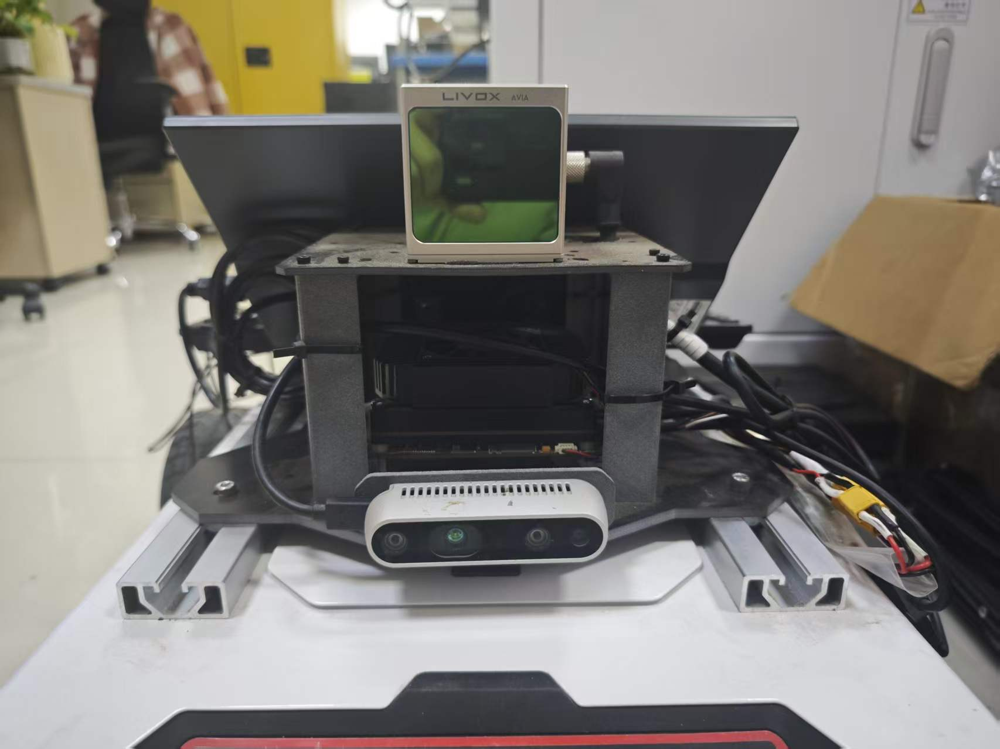
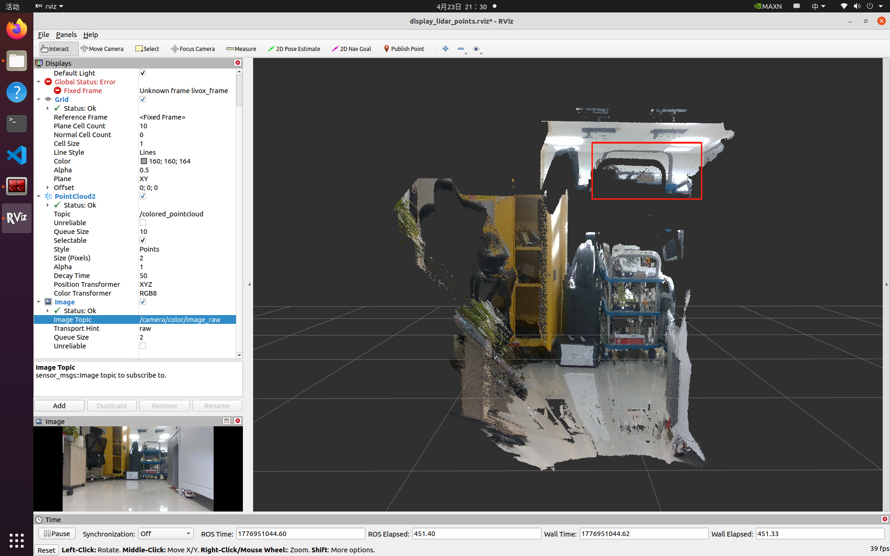
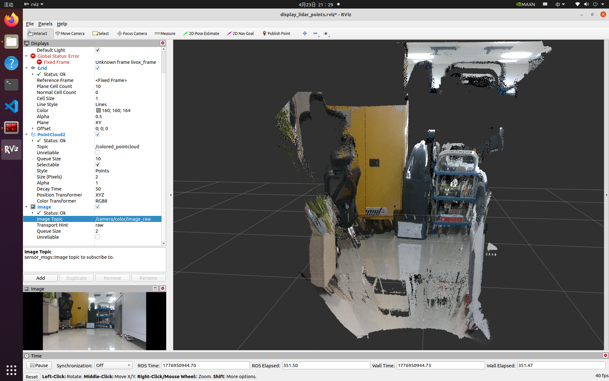
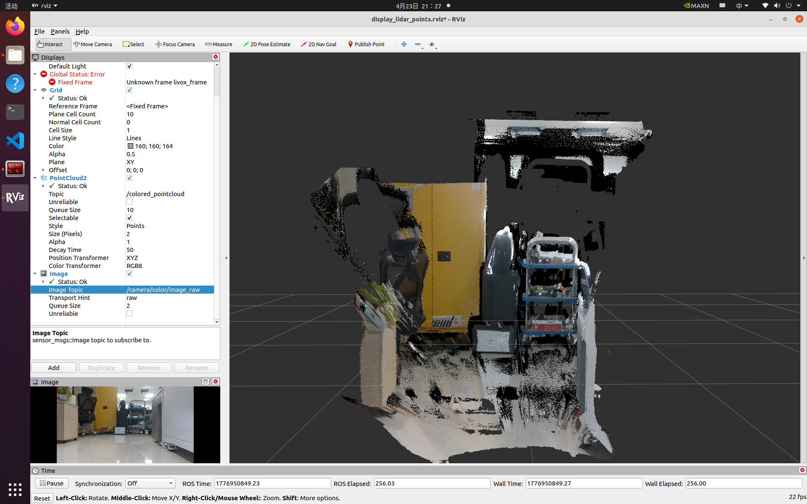

# occlusion_culling
使用相机给点云上色的一个小尝试。

我的架构：

## 可以逐点利用相机与雷达的外参，将点云变换到相机坐标系，再利用相机内参映射到像素平面，使用对应像素颜色给点云上色。

- 失效场景：当雷达打出一个点p1在背景墙面，而p1到相机光心o之间具有其他前景障碍物，则会将前景障碍物的颜色赋值给背景墙面的点云。

## 利用z-buffer深度缓存技术，先创建一个与图片宽高一致的深度缓存，每个点初始化为数值最大值，当雷达点云经过内外参变换投影到像素平面时，若该点的深度 < 深度缓存上记录的深度，则更新深度缓存记录该点深度，由此可找到该像素位置最前面的物体。

- 失效场景：**在理想情况下，应该有一个前景点也投影到(u,v)，并且深度更小，从而在Z-buffer中挡住背景点**。但是因为雷达点云稀疏，前景物体在这个局部可能刚好没有扫描到点，导致没有前景点投影到确切的(u,v)坐标上。结果就是，这个背景点成了投影到(u,v)的唯一候选者，它“赢”了Z-buffer测试，然后错误地窃取了前景的颜色。

## 为了解决稀疏性导致的漏洞，在构建Z-buffer后，对其进行空间上的膨胀，然后再进行深度比较。

- **当erode kernel = 5时，可以看见背景误上色点云正在被侵蚀**

- **当erode kernel = 20时，背景误上色点云已被清理干净**

# LICENSE

[MIT LICENSE](LICENSE)

